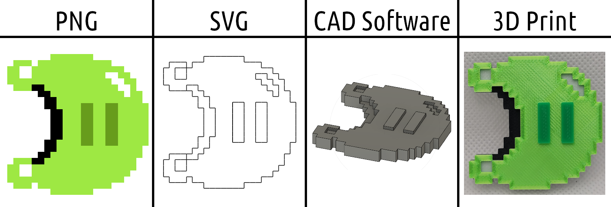

## Pixel-Art_to_SVG

This script takes a PNG image and converts it into a monochrome SVG. It does this by checking where neighboring pixels are sufficiently different and, where appropriate, drawing a line between them.

---

Any transparent pixels in the image are converted to a specified color (`convert_transparent_to_color`). They become white by default.

You can adjust the detection threshold for differences between neighboring pixels (`DIFFERENCE_THRESHOLD`). Images are converted to grayscale during processing so they will have a value between 0 (black) and 100 (white). If two adjacent pixels are sufficiently different then a line will be drawn between them. This behavior is illustrated below (values not to scale):

SVG images can be resized without any information being lost, but `drawsvg` allows for some nominal scaling so that option is made available to the user. Set `OUTPUT_SCALE` at the top of the script. By default the output image size will match the input.

---

An example of how this script might be used is shown below. I found that commonly used PNG-to-SVG conversion utilities made a mess of pixel art. This script draws clean lines in a grid pattern—nothing more, nothing less.

---

**To use:**

1. Required dependencies are `OpenCV`, `Numpy`, and `drawsvg`. If you don't have them installed or you're using old versions, run `pip3 install -r requirements.txt`.
2. Set image path and desired options at the top of `main.py` and run.